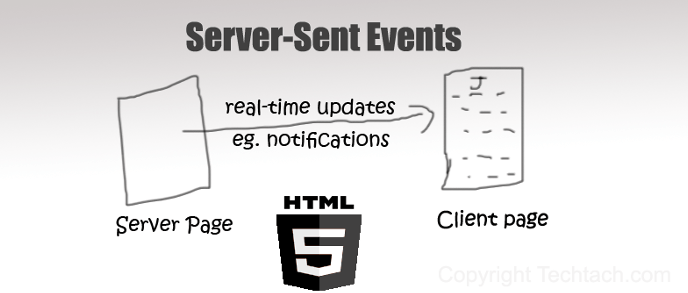
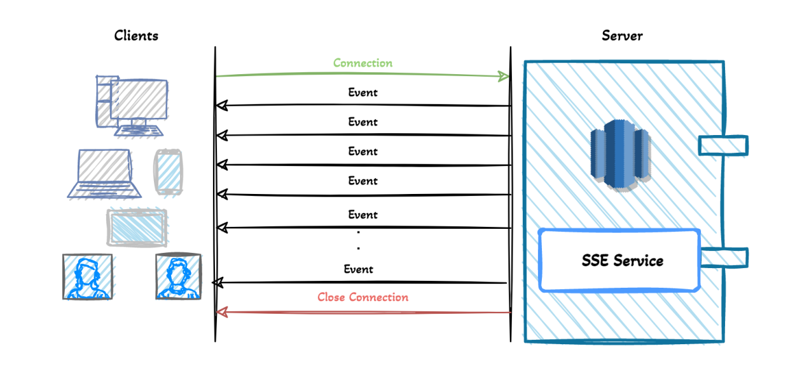

# SSE服务器---->客户端单向通信

### 一、SSE的本质
严格地说，HTTP 协议无法做到服务器主动推送信息。但是，有一种变通方法，就是服务器向客户端声明，接下来要发送的是流信息（streaming）。

也就是说，发送的不是一次性的数据包，而是一个数据流，会连续不断地发送过来。这时，客户端不会关闭连接，会一直等着服务器发过来的新的数据流，视频播放就是这样的例子。本质上，这种通信就是以流信息的方式，完成一次用时很长的下载。

SSE 就是利用这种机制，使用流信息向浏览器推送信息。它基于 HTTP 协议，目前除了 IE/Edge，其他浏览器都支持。

### 二、SSE的特点

### 三、与WebSocket对比优缺点
SSE与WebSocket作用相似，都可以建立服务端与浏览器之间的通信，实现服务端向客户端推送消息，但还是有些许不同：
* SSE 是基于HTTP协议的，它们不需要特殊的协议或服务器实现即可工作；WebSocket需单独服务器来处理协议。
* SSE 单向通信，只能由服务端向客户端单向通信；webSocket全双工通信，即通信的双方可以同时发送和接受信息。
* SSE 实现简单开发成本低，无需引入其他组件；WebSocket传输数据需做二次解析，开发门槛高一些。
* SSE 默认支持断线重连；WebSocket则需要自己实现。
* SSE 只能传送文本消息，二进制数据需要经过编码后传送；WebSocket默认支持传送二进制数据。
### 四、 使用流程
* 创建AtomicInteger用于记录连接数
* 创建ConcurrentHashMap用于存放连接信息
* 建立连接：创建并返回一个带有超时时间的SseEmitter给前端。超时间设为0表示永不过期
* 设置连接结束的回调方法completionCallBack
* 设置连接超时的回调方法timeoutCallBack
* 设置连接异常的回调方法errorCallBack
* 创建推送信息的方法SseEmitter.send()
* 创建移除连接的方法

