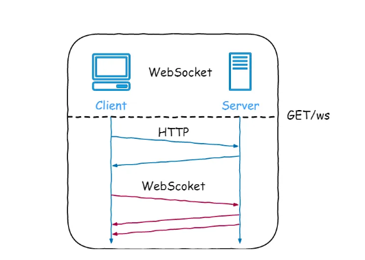

# WebSocket服务器<--->客户端双向通信



### 一、WebSocket的本质
WebSocket是一种基于HTTP的长链接技术。传统的HTTP协议是一种请求-响应模型，如果浏览器不发送请求，那么服务器无法主动给浏览器推送数据。如果需要定期给浏览器推送数据，例如股票行情，或者不定期给浏览器推送数据，例如在线聊天，基于HTTP协议实现这类需求，只能依靠浏览器的JavaScript定时轮询，效率很低且实时性不高。因为HTTP本身是基于TCP连接的，所以，WebSocket在HTTP协议的基础上做了一个简单的升级，即建立TCP连接后，浏览器发送请求时，附带几个头：

    GET /chat HTTP/1.1
    Host: www.example.com
    Upgrade: websocket
    Connection: Upgrade
就表示客户端希望升级连接，变成长连接的WebSocket，服务器返回升级成功的响应：

    HTTP/1.1 101 Switching Protocols
    Upgrade: websocket
    Connection: Upgrade
收到成功响应后表示WebSocket“握手”成功，这样，代表WebSocket的这个TCP连接将不会被服务器关闭，而是一直保持，服务器可随时向浏览器推送消息，浏览器也可随时向服务器推送消息。双方推送的消息既可以是文本消息，也可以是二进制消息，一般来说，绝大部分应用程序会推送基于JSON的文本消息。

现代浏览器都已经支持WebSocket协议，服务器则需要底层框架支持。Java的Servlet规范从3.1开始支持WebSocket，所以，必须选择支持Servlet 3.1或更高规范的Servlet容器，才能支持WebSocket。最新版本的Tomcat、Jetty等开源服务器均支持WebSocket。
### 二、WebSocket+SpringBoot的使用
* springboot整合websocket，先引入websocket相关的工具包，和SSE相比额外的开发成本。
```
<!-- 引入websocket -->
<dependency>
    <groupId>org.springframework.boot</groupId>
    <artifactId>spring-boot-starter-websocket</artifactId>
</dependency>
```
* 服务端使用@ServerEndpoint注解标注当前类为一个websocket服务器，客户端可以通过ws://localhost:7777/webSocket/10086来连接到WebSocket服务器端。
```java
@Component
@Slf4j
@ServerEndpoint("/websocket/{userId}")
public class WebSocketServer {
    //与某个客户端的连接会话，需要通过它来给客户端发送数据
    private Session session;
    private static final CopyOnWriteArraySet<WebSocketServer> webSockets = new CopyOnWriteArraySet<>();
    // 用来存在线连接数
    private static final Map<String, Session> sessionPool = new HashMap<String, Session>();
    /**
     * 链接成功调用的方法
     */
    @OnOpen
    public void onOpen(Session session, @PathParam(value = "userId") String userId) {
        try {
            this.session = session;
            webSockets.add(this);
            sessionPool.put(userId, session);
            log.info("websocket消息: 有新的连接，总数为:" + webSockets.size());
        } catch (Exception e) {
        }
    }
    /**
     * 收到客户端消息后调用的方法
     */
    @OnMessage
    public void onMessage(String message) {
        log.info("websocket消息: 收到客户端消息:" + message);
    }
    /**
     * 此为单点消息
     */
    public void sendOneMessage(String userId, String message) {
        Session session = sessionPool.get(userId);
        if (session != null && session.isOpen()) {
            try {
                log.info("websocket消: 单点消息:" + message);
                session.getAsyncRemote().sendText(message);
            } catch (Exception e) {
                e.printStackTrace();
            }
        }
    }
}
```
* 前端初始化打开WebSocket连接，并监听连接状态，接收服务端数据或向服务端发送数据。
```javascript
<script>
    var ws = new WebSocket('ws://localhost:7777/webSocket/10086');
    // 获取连接状态
    console.log('ws连接状态：' + ws.readyState);
    //监听是否连接成功
    ws.onopen = function () {
        console.log('ws连接状态：' + ws.readyState);
        //连接成功则发送一个数据
        ws.send('test1');
    }
    // 接听服务器发回的信息并处理展示
    ws.onmessage = function (data) {
        console.log('接收到来自服务器的消息：');
        console.log(data);
        //完成通信后关闭WebSocket连接
        ws.close();
    }
    // 监听连接关闭事件
    ws.onclose = function () {
        // 监听整个过程中websocket的状态
        console.log('ws连接状态：' + ws.readyState);
    }
    // 监听并处理error事件
    ws.onerror = function (error) {
        console.log(error);
    }
    function sendMessage() {
        var content = $("#message").val();
        $.ajax({
            url: '/socket/publish?userId=10086&message=' + content,
            type: 'GET',
            data: { "id": "7777", "content": content },
            success: function (data) {
                console.log(data)
            }
        })
    }
</script>
```


